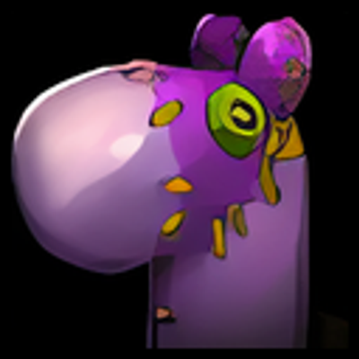

Don't forget me ! 

by Reikan

**Automatically summon a battle pet (favorite or not). Sync your pet with GUILD, PARTY or RAID !**
Don't leave your companions behind !

**Version 1.1.0 (110005_1_1_0) :**
- New core to avoid blocked actions
- Added the ability to synchronise your pet with your guild, group or raid using the command: /dfm_sync guild, raid or party
- Added new settings to enable or disable pet sync
- Better detection of player status
- Added translation texts for French / English
  

**Version 1.0.2 (110002_1_0_2) :**
- Add stealth support !
  

**Version 1.0.1 (110002_1_0_1) :**
- Clean code
- Add new registered events to ensure pet is summoned (after a fall, after AFK)
- Rework settings panel
  

**Version 1.0 (110002_1_0_0) :**
- Add an option to invoke only favorite pet or not
- Raise on multiples events to ensure your companion is always behind you !
